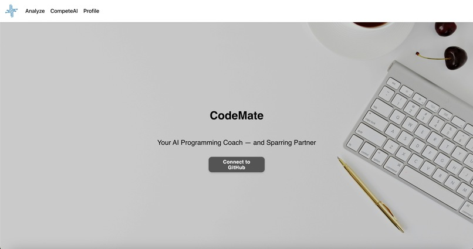
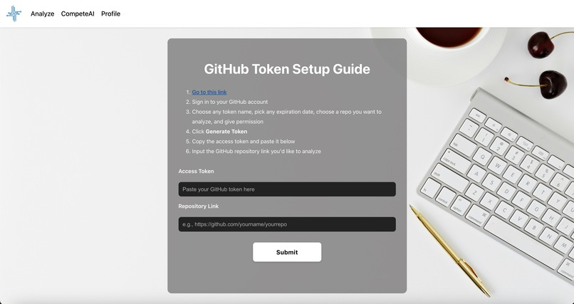
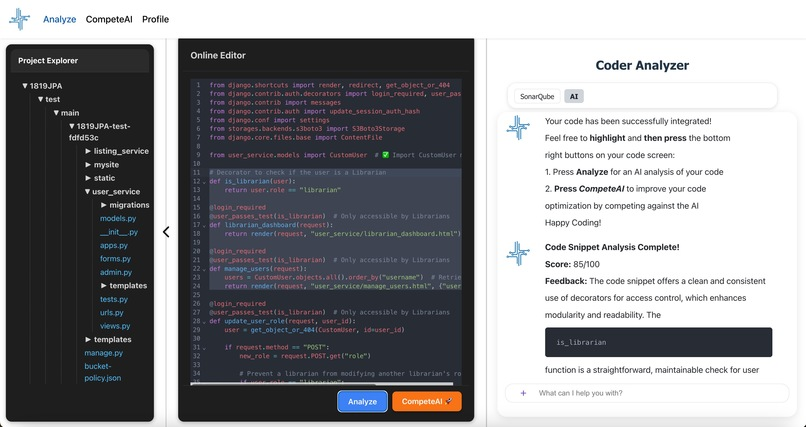
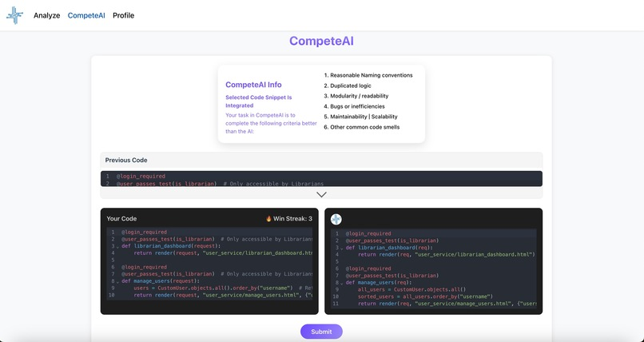

# CodeMate - Personal Code Mentor System

CodeMate is a personal AI-powered code mentor designed to help developers analyze, improve, and optimize their code. By combining **AI analysis with SonarQube** and **gamified practice**, CodeMate empowers users to refine their programming skills, gain optimization intuition, and build stronger coding habits.

---

## 🚀 Features

- **Code Analysis with AI & SonarQube**  
  Perform in-depth analysis of your codebase using SonarQube integrated with AI. Users can directly interact with the AI to ask questions and get tailored feedback for improvement.

- **Compete Against the AI**  
  Challenge the AI in optimization battles where your code is judged against AI-generated alternatives. Build your ability to see optimization paths instantly.

- **Gamified Learning**  
  Track **winning streaks, stats, and progress** as you compete against yourself.

---

## 🛠 Tech Stack

**Frontend**
- React (Vite)  
- Auth0 (authentication & login)

**Backend**
- Python (Flask) + OpenAI API (AI logic)  
- Java (Spring Boot) + SQLite (user data & code storage)  
- Git API (access to user repositories)  
- SonarQube (static code analysis) running on Docker  

---

## 📸 Demo Screenshots





---

## ⚡ Getting Started

### Prerequisites
- Node.js & npm  
- Python 3.x  
- Docker (for SonarQube)  
- Java 17+  

## ⚙️ Installation & Setup

CodeMate is split across multiple repositories under the [HoooHacks](https://github.com/HoooHacks) organization.  
Clone and set up each repo locally to run the full system.

### 1. Frontend (React + Vite)
```bash
git clone https://github.com/HoooHacks/front-end
cd front-end
npm install
npm run dev
```
### 2. OpenAI API Backend (Python + Flask)
```bash
git clone https://github.com/HoooHacks/OpenAI_api_backend
cd OpenAI_api_backend
pip install -r requirements.txt
python app.py
```
### 3. Main Backend (Java + Spring Boot + SQLite)
```bash
git clone https://github.com/HoooHacks/back-end
cd back-end
./mvnw spring-boot:run
```
### 4. SonarQube (Docker)
Make sure you have Docker installed, then run:

```bash
docker run -d --name sonarqube -p 9000:9000 sonarqube
```
### 5. Environment Variables
Configure Auth0 credentials in both frontend and backend.

Provide your OpenAI API Key in the Python backend.

Set up GitHub API tokens for repository access.

### 6. Running the System
Start backend services (back-end and OpenAI_api_backend).

Start SonarQube via Docker.

Run the frontend with npm run dev.

Log in with Auth0 and begin analyzing/competing against the AI.

👥 Contributors

Yunki Cho

Hyun Lee

Yoon Lee

📜 License
This project is licensed under the MIT License.
